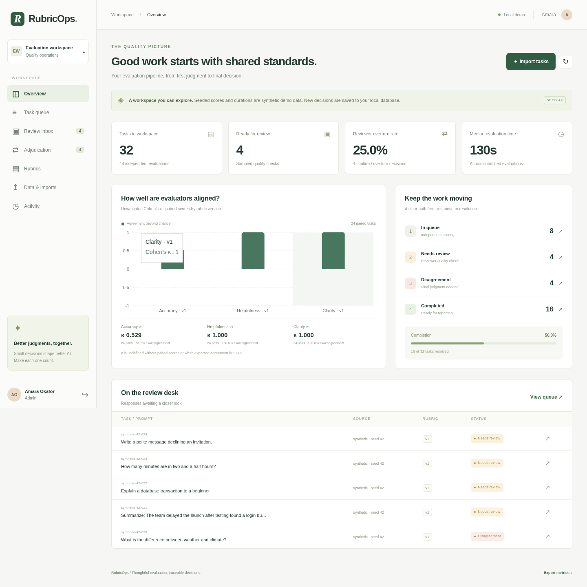
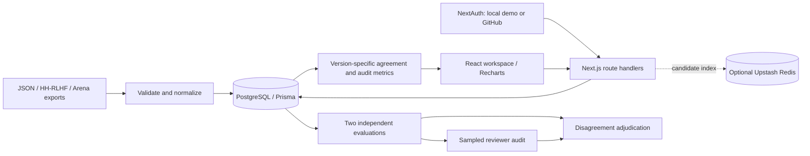

# RubricOps

[Repository](https://github.com/judie-paul/rubricops) · [CI checks](https://github.com/judie-paul/rubricops/actions)

An evaluation review platform for teams scoring model responses. Tasks enter a
queue, two evaluators independently score each response against a fixed rubric,
reviewers audit sampled work, and admins resolve disagreements. The dashboard
reports agreement per criterion, reviewer overturns, and time spent evaluating.



## Run locally

Requires Node.js 22.12+ (tested on 24), npm, Docker and Docker Compose.

```sh
make setup
make pipeline
make dev
```

Open http://localhost:3001. Choose an account and use `rubricops-demo` as the local
password. `scripts/setup.mjs` generates a random session secret in a gitignored
`.env`; it preserves an existing file. The four accounts are:

| Account                      | Role      | Workflow                                         |
| ---------------------------- | --------- | ------------------------------------------------ |
| `evaluator@rubricops.local`  | Evaluator | Claim and score tasks                            |
| `evaluator2@rubricops.local` | Evaluator | Independent second scores                        |
| `reviewer@rubricops.local`   | Reviewer  | Confirm, overturn, or escalate audits            |
| `admin@rubricops.local`      | Admin     | Imports, rubric publishing, audits, adjudication |

The seed is idempotent: 32 synthetic tasks, 48 historical evaluations, one rubric,
and four users. It never overwrites existing tasks or user decisions. No paid API,
dataset download, or hosted account is needed after dependencies and images are
installed. The credentials above are for local demonstration only.

For the full container app, run `make setup && make docker`, then seed once:

```sh
docker compose exec app npx tsx scripts/seed.ts
```

The app and database bind to loopback ports 3001 and 55432. Compose stores database
records in a named volume. Normal container restarts preserve work. Do not remove
the volume unless you intend to delete it.

## Workflow

1. An admin imports a JSON array and assigns a published rubric version.
2. An evaluator selects **Start evaluating**. A task has at most two active or
   completed evaluation slots; each evaluator can contribute only once. Claims
   expire after 20 minutes and can be released. Closing the dialog retains a claim;
   selecting Start evaluating reopens it.
3. Submissions require a 1–5 integer score for every assigned criterion and a
   rationale. Timing is measured on the server from claim to submission.
4. Any differing criterion score routes the task to adjudication. Matching scores
   enter reviewer audit if selected by the deterministic 25% hash sample; otherwise
   the task is complete. Small batches need not contain exactly 25% sampled tasks.
5. A reviewer confirms original scores, changes scores with an overturn, or
   escalates. An admin adjudicates with a final set of scores and rationale.
   Evaluations and subsequent review decisions remain separate historical records.

Evaluators cannot see other evaluators' scores or reviewer decisions, even through
the API. Admin permissions are checked on the server. Role changes take effect on
the next API request. Published rubrics have no update/delete operation; new
versions affect only tasks explicitly imported against them.

## Architecture



The starter's Next.js 16 is retained rather than downgraded to the original brief's
Next.js 14. Prisma 6 manages PostgreSQL migrations. Serializable transactions and
unique constraints arbitrate claims, submissions and publication; serialization
conflicts are retried. Redis is an optional candidate index, never the authority for
ownership. Stale or unavailable Redis entries cannot lose or double-assign tasks.

## Data

The import screen accepts up to 500 records and 2 MB per request. Import batches
are atomic; invalid records and existing external IDs reject the entire batch.
All committed fixtures are synthetic examples, not copies of public datasets.

- **Normalized**: `externalId`, `prompt`, `response`, `source` (strings).
- **HH-RLHF export**: add a stable string `id` to each record; supply the `chosen`
  transcript. The last `Assistant:` turn is the response, earlier context is the
  prompt. `rejected` is not evaluated by this adapter.
- **Arena export**: supply a string `question_id` and `conversation_a` messages.
  The first assistant response and preceding context become one task. Later turns
  and conversation B are intentionally outside this adapter's scope.

See `fixtures/import.json`, `fixtures/hh.json`, and `fixtures/arena.json`.
Public sources from the brief are
[Anthropic HH-RLHF](https://huggingface.co/datasets/Anthropic/hh-rlhf) and
[LMSYS Chatbot Arena Conversations](https://huggingface.co/datasets/lmsys/chatbot_arena_conversations).
Acquire exports separately under their access and license terms. Imports do not
make network calls. Every task retains its source and external ID.

## Metrics and measured results

`npm run results` writes `docs/results.json` from the current database. The UI also
exports the same metrics as JSON. See [measured results](docs/results.md).

- Cohen's kappa is unweighted and computed from the two original evaluator scores,
  separately for each rubric version and criterion. Reviewer scores are excluded.
- Empty pairs and expected agreement of 100% produce `null`, displayed as undefined.
- Exact agreement is the fraction of paired scores that match.
- Overturn rate is overturned audits divided by confirm + overturn audits;
  escalations and adjudications are excluded. No completed audits produces `null`.
- Median evaluation time uses all completed evaluations. It measures elapsed claim
  time, including idle time, not active attention. Seeded timing is synthetic.

## Verification

```sh
make check                 # ESLint, TypeScript, formatting, unit tests
npm run build              # production build
# Create an isolated database once:
docker compose exec db createdb -U rubricops rubricops_test
make test-integration      # migrations and transactional workflow tests
npx playwright install chromium
make dev                   # in another terminal
make browser               # desktop/mobile workflows and access checks
```

`TEST_DATABASE_URL` can override the integration target but must name
`rubricops_test`. Integration tests clear only that database. Browser tests mutate
the database used by their running app (adding one rubric/task and recording
several decisions); use a dedicated seeded test instance when preserving demo data
matters. CI config provisions isolated PostgreSQL and runs these checks. Local
results are recorded in [PROGRESS.md](PROGRESS.md); configured CI is not evidence
of a remote run.

## Hosted configuration

See [deployment notes](docs/deployment.md). Supabase PostgreSQL, GitHub OAuth,
Upstash Redis, and Vercel are configurable integrations. No hosted project has
been provisioned and no public deployment is claimed. The application currently
reads the full task collection for its dashboard, so use bounded evaluation
batches; large-scale deployments need pagination and incremental metrics.

## License

MIT. See [LICENSE](LICENSE).
